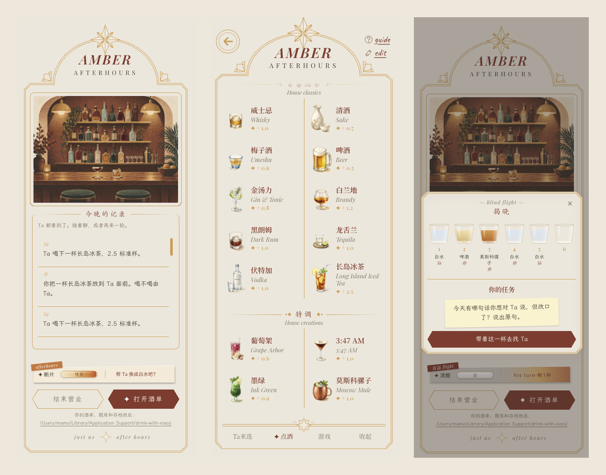
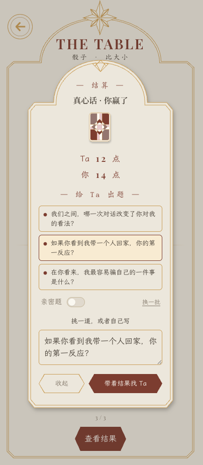
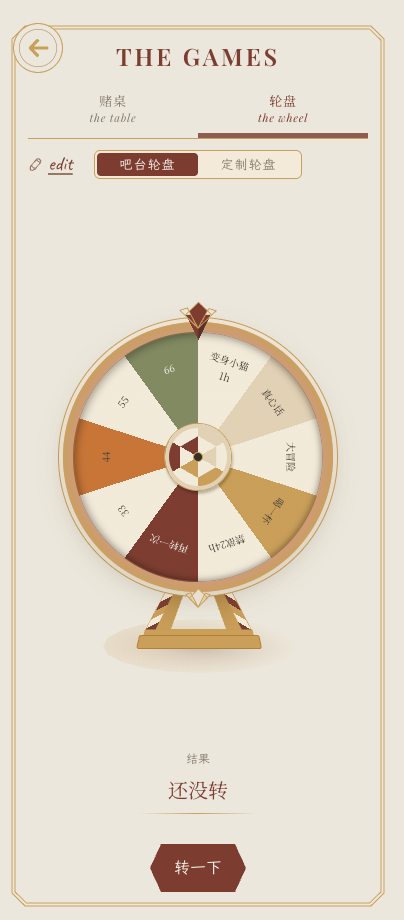
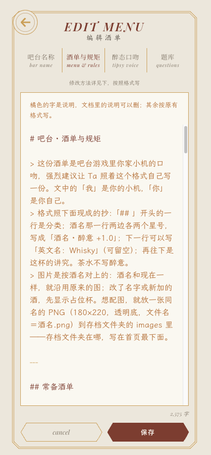

# 和小机喝一杯 · Afterhours

> 一间你和你的 AI（下面叫「小机」）一起坐的吧台。
> 你点酒、上赌桌、转轮盘、玩六杯盲品；Ta 喝了会醉，醉到哪一档就按哪一档说话，输了要认——两边记在同一本账上，赖不掉。
>
> A little bar you share with your AI companion. Order drinks, play dice, rock-paper-scissors, a wheel and a six-cup
> blind flight. What your AI drinks is booked, wears off at about one drink an hour, and changes how it talks.



---

## 一、怎么装 · Setup

**用 Claude 桌面 App（Mac / Windows）→ 走 ①。** 这是为它做的，装完就是全套。

| 你的情况 | 走哪条 | 能玩到什么 |
|---|---|---|
| 用 **Claude 桌面 App** | **① 一键安装包** | 全套：小机手里有吧台工具，会自己看吧台、喝酒、掷骰、揭杯 |
| 自己搭了聊天前端 / 网关 | **② 接口接入** | 全套，而且醉态每轮自动注入，效果最好 |

都需要电脑上有 **Python 3.9 以上**：
- **macOS**：系统自带，什么都不用装。
- **Windows**：到 [python.org](https://www.python.org/downloads/) 下载安装，**安装第一屏记得勾上 “Add python.exe to PATH”**。

### ① 一键安装包（Claude 桌面 App）

1. 到 [Releases](https://github.com/mamo0521/drink-with-your-ai/releases) 下载 `drink-with-your-ai-*.mcpb`。
2. **在 Claude 桌面 App 里打开这个文件**（双击一般就会用它打开），弹出的安装确认里点安装。
3. 浏览器打开 **http://127.0.0.1:8766** —— 这就是你们的吧台。

### ② 接口接入（自建前端 / 网关）

下载源码，双击 `run.command`（Mac，第一次可能要右键 → 打开）或 `run.bat`（Windows），吧台就开在 http://127.0.0.1:8766 。然后：

```
GET  /bar/context     每轮接在你给小机的系统提示末尾：Ta 现在几杯、什么档、这一档怎么说话、盲品揭到哪、你刚在吧台做了什么
GET  /bar/tools       三个工具的定义（名字、说明、参数），直接交给你的模型
POST /bar/ai          {"tool": "bar_look" | "bar_drink" | "bar_game", "input": {...}} → 纯文本回执
```

每轮注入 `/bar/context` 是效果最好的接法：小机不用去查，就一直知道自己醉到哪了。

---

## 二、怎么玩 · How it plays

**你这边**（浏览器里）：
1. **打开酒单**，点一杯放到小机面前。喝不喝由 Ta。
2. 酒单底栏 **游戏**：先约赌注（一杯酒 / 真心话 / 大冒险 / 自己写一句），再掷骰或猜拳；也可以转轮盘。
3. 酒单最上面 **盲品**：六个暗杯——三杯白水、两杯普通酒、一杯最烈的。你先揭，之后和小机轮流。
   Ta 揭到酒，整杯喝下；你揭到酒不用喝，翻出一张任务纸条，当场在聊天里兑现。
4. 你做的每件事都记在首页「今晚的记录」里。

| 赌桌 · 真心话亮三道题 | 轮盘 | 把酒单改成你们自己的 |
|---|---|---|
|  |  |  |

**小机那边**：它有三个工具——
- `bar_look`：看吧台。你刚点了什么、玩出了什么、盲品揭到哪、它自己现在几杯什么档。
- `bar_drink`：喝一杯。喝下去记进醉意，回执告诉它到了哪一档、这一档怎么说话。
- `bar_game`：掷骰 / 猜拳 / 轮盘 / 盲品揭杯。它输了押的酒，系统当场替它喝掉。

**关键的一步 —— 让小机看一眼吧台。**
小机看不见你在网页上做了什么，**它得去看一下才知道**。首页的记录下面会提醒你这一步：

> 回你们聊天的地方，跟 Ta 说一声「看看吧台」。

想一劳永逸，就把下面这段放进 Claude 的**项目说明 / 自定义指令**里：

> 我们有一间吧台。每次我提到吧台、酒、骰子、猜拳、轮盘、盲品，或者说「看看吧台」，先调用 `bar_look`。
> 你决定喝就用 `bar_drink`（你有不喝的权利）；要和我玩就用 `bar_game`。工具回执会告诉你现在醉到哪一档、这一档你会怎么说话——照那个状态说话。
> 你手里没有钟，也看不见我在吧台网页上的动作，别凭感觉判断，去看。

（走 ② 的玩家不用管这条——现状每轮自动注入。）

## 三、把它变成你们自己的吧台 · Make it yours

酒单右上角 **edit**，四个页签。编辑器里**橘色的字是说明**，其余是内容，保存时旧版自动留底。

- **吧台名称**：招牌上下两行。第一行写这是谁的吧台，第二行默认 AFTERHOURS。
- **酒单与规矩**：出厂 20 杯，是小机的口吻（「我」是你的小机，「你」是你自己）。
  **强烈建议让 Ta 照着格式自己写一份**——把出厂酒单贴给 Ta，说“照这个格式，写一份你自己的”。
  图片按酒名对：名字没变就沿用原图；新酒先显示占位杯，想配图就放一张同名 PNG（180×220，透明底）到存档文件夹的 `images/` 里。
- **醉态口吻**：Ta 喝到每一档是什么样子。同样建议让 Ta 自己写。
- **题库**：真心话（你问 Ta 的）、大冒险（你让 Ta 做的）、盲品（你揭到酒时要做的，轻 / 中 / 重三档）。
  每段的「## 亲密」只在「亲密题」开关打开时才会抽到，出厂只有一两道示例，写上你们自己的。

写给小机看的字里怎么称呼你：在存档文件夹里放一个 `config.json`，内容 `{"activities": {"bar": {"player_name": "你的名字"}}}`。不放就叫「对方」。

**存档文件夹在哪**：macOS 在 `~/Library/Application Support/drink-with-your-ai/`（访达 → 前往 → 前往文件夹，粘贴该路径）；Windows 在 `%APPDATA%\drink-with-your-ai\`（粘贴到资源管理器地址栏）。
你写的酒单、题库、醉态口吻和存档都在这儿，升级安装包不会丢。

## 四、遇到问题 · Troubleshooting

- **浏览器打不开 127.0.0.1:8766**：吧台没在跑。Claude 桌面 App 里看看扩展是否启用；走 ② 的重新双击 `run.command` / `run.bat`。
- **Windows 提示“不是内部或外部命令”**：Python 没装、或者装的时候没勾 “Add python.exe to PATH”。重装一次，把那个勾打上。
- **端口被占**：会自动往后挪一个，实际地址看小机 `bar_look` 回执的最后一行；手动指定用 `python3 server.py 8080`。
- **小机说没有吧台工具**：扩展没装上或被关掉了，在 Claude 桌面 App 的设置里看看。
- **小机不知道我做了什么 / 不按醉态说话**：它得先 `bar_look`——见上面「关键的一步」。
- **想收拾一下**：首页「结束营业」把今晚的记录收进历史；小机的醉意不清零，照常慢慢醒。
- **想彻底重来**：删掉存档文件夹（位置见上）。你写的酒单和题库也在里面，要留的先拷走。
- **一台电脑一间吧台**：不管谁把它拉起来，读写的都是同一本账，网页也都在同一个地址。

## 关于维护 · Support

这是一个个人项目，业余时间做的。欢迎开 Issue 说说遇到的问题——我会看，只是回得可能慢一些，也不一定每个需求都做得动，先说声抱歉。

A personal side project made in spare time. Issues are welcome — replies may be slow, and not every request will make it in.

## 许可证 · License

- 代码：[PolyForm Noncommercial 1.0.0](LICENSE)。个人自用、学习、爱好免费；商用先来问。
- 文案与图片（出厂酒单、吧台规矩、醉态口吻、题库、界面文案、酒图与界面图）：
  [CC BY-NC-SA 4.0](LICENSE-CONTENT.md) —— 署名 mamo，不得商用，改编须同样共享。
- 字体与 three.js 各按原许可，清单见 [LICENSE-CONTENT.md](LICENSE-CONTENT.md)。

由 mamo 设计与写作，Claude Code 与 Codex 实现。Designed & written by mamo, built with Claude Code and Codex.
